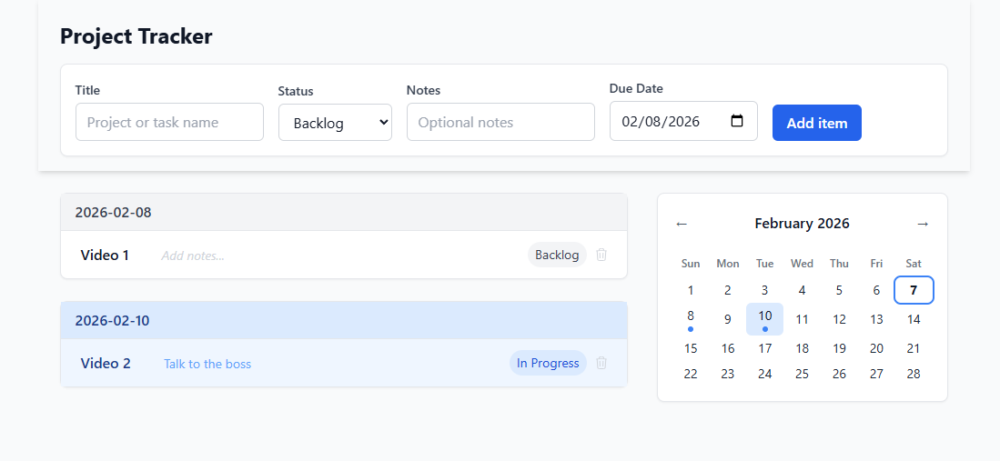

# Project Tracker

Minimal project tracker built with Next.js, Tailwind CSS, and server actions. Create items with a title, status, notes, and date, then view them in a date-grouped list with inline editing. A monthly calendar lets you filter by clicking a date.



## Run the app

```bash
npm install
npm run dev
```

Open [http://localhost:3000](http://localhost:3000).

## Features

- **Add items** — form with title, status (backlog / in progress / stuck / done), optional notes, and date
- **Inline editing** — click any title or notes field to edit it in place
- **Delete items** — remove items with a confirmation dialog
- **Clickable status badges** — cycle through statuses by clicking the badge
- **Date-grouped list** — items sorted and grouped by date
- **Monthly calendar** — navigate months, see dots on days with items, click to filter
- **Date filtering** — click a calendar date to filter the list; click again or "Show all" to clear
- **Sticky header** — frosted-glass header stays visible while scrolling

## File structure

```
├── app/
│   ├── actions.ts                  # Server actions: create, update, delete
│   ├── components/
│   │   ├── Calendar.tsx            # Monthly grid calendar (client component)
│   │   ├── DeleteButton.tsx        # Delete button with confirmation modal
│   │   ├── EditableField.tsx       # Inline-editable text field
│   │   ├── ProjectCalendarView.tsx # Two-column layout: list + sticky calendar
│   │   ├── ProjectItemForm.tsx     # Form: title, status, notes, date, submit
│   │   ├── ProjectItemList.tsx     # List grouped by date
│   │   └── StatusBadge.tsx         # Clickable status badge with dropdown
│   ├── globals.css
│   ├── layout.tsx                  # Root layout
│   └── page.tsx                    # Single page: form + list + calendar
├── lib/
│   ├── store.ts                    # In-memory store (CRUD operations)
│   └── types.ts                    # ProjectItem type, ProjectItemStatus
├── package.json
├── tailwind.config.ts
├── tsconfig.json
└── next.config.ts
```

## Data

- **Model**: `ProjectItem` — `id`, `title`, `notes`, `status` (backlog | in_progress | stuck | done), `date` (YYYY-MM-DD).
- **Storage**: In-memory only; data is lost on server restart.
